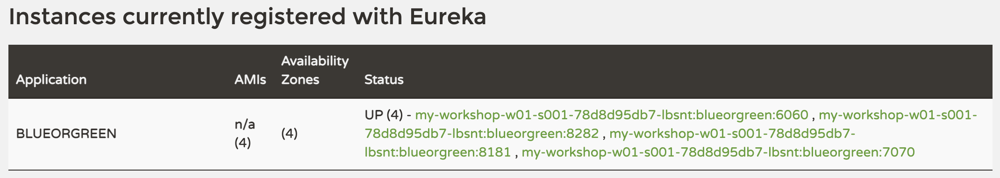
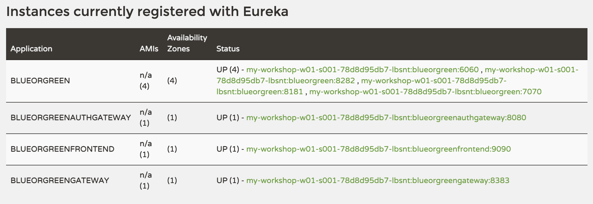

# Run locally

In this section, you will run the application in the workshop terminal to see the application in action.

## Start Config Server and Eureka Discovery Server
The applications are configured to connect to a Config Server and a Eureka Discovery Server running locally in order to retrieve their configuration and find one another.

You can use the Spring Cloud CLI to start an instance of each server.

Start Config Server.
> Note: The following startup commands will run the Java processes in the background, so you won't see the app startup log appear in the terminal window.
> Instead, any logging will be redirected to a file.
```execute-1
nohup spring cloud configserver > configserver-log.out 2>&1 </dev/null &
```

Run the following command repeatedly until you see a line of output confirming the Config Server has started.
```execute-1
cat ~/color-app/configserver-log.out | grep "started on port"
```

The output should look like this.
```
2021-04-20 21:57:03.216  INFO 658 --- [           main] o.s.b.w.embedded.tomcat.TomcatWebServer  : Tomcat started on port(s): 8888 (http) with context path ''
```

Start Eureka Server.
```execute-1
nohup spring cloud eureka > eurekaserver-log.out 2>&1 </dev/null &
```

Run the following command repeatedly until you see a line of output confirming the Eureka Server has started.
```execute-1
cat ~/color-app/eurekaserver-log.out | grep "started on port"
```

The output should look like this.
```
2021-04-20 21:57:27.152  INFO 716 --- [           main] o.s.b.w.embedded.tomcat.TomcatWebServer  : Tomcat started on port(s): 8761 (http) with context path ''
```

Once Eureka has started, you can access its dashboard:
```dashboard:open-url
url: http://{{ session_namespace }}-eureka.{{ ingress_domain }}/
```

## Start Color Application apps

Next, build and start a Color Application instance using the `blue` profile.
```execute-1
cd blueorgreenservice && ./mvnw package -DskipTests > build-log.out 2>&1 </dev/null && \
nohup java -Xmx128M -Dspring.profiles.active=blue -jar target/blueorgreen-0.0.1-SNAPSHOT.jar > log-blue.out 2>&1 </dev/null &
```

Run the following command repeatedly until you see a line of output confirming the Eureka Server has started.
```execute-1
cat ~/color-app/blueorgreenservice/log-blue.out | grep "started on port"
```

The output should look like this.
```
2021-04-20 21:58:43.563  INFO 798 --- [           main] o.s.b.w.embedded.tomcat.TomcatWebServer  : Tomcat started on port(s): 8181 (http) with context path ''
```

As you can see in the log output, `blue` started on port 8181.

Validate that the `blue` app is running. 

```execute-1
http -b :8181
```

Your output will look like this.
```
{
    "id": "blue"
}
```

Refresh the Eureka dashboard in your browser until you see that the `blue` app has registered itself. 
It uses the application name `BLUEORGREEN`.

Start three more Color App instances: green, slowgreen (which takes 5 seconds to respond), and yellow. 
The profiles are configured such that each will run on a different port.
```execute-1
cd blueorgreenservice && nohup java -Xmx128M -Dspring.profiles.active=green -jar target/blueorgreen-0.0.1-SNAPSHOT.jar > log-green.out 2>&1 </dev/null &

cd blueorgreenservice && nohup java -Xmx128M -Dspring.profiles.active=slowgreen -jar target/blueorgreen-0.0.1-SNAPSHOT.jar > log-slowgreen.out 2>&1 </dev/null &

cd blueorgreenservice && nohup java -Xmx128M -Dspring.profiles.active=yellow -jar target/blueorgreen-0.0.1-SNAPSHOT.jar > log-yellow.out 2>&1 </dev/null &
```

Refresh the Eureka dashboard again until you see all four color app instances registered.
You should see an Application named `BLUEORGREEN` with four endpoints under the `Status` column, each with a unique port number.

> Picture for reference of apps registered in Eureka Server:


Validate that the `slowgreen` takes 5 seconds to return.
```execute-1
time http :6060
```

Next, start the frontend application, the routing gateway, and the auth gateway.
```execute-1
cd blueorgreenfrontend && ./mvnw package -DskipTests > build-log.out 2>&1 </dev/null && \
nohup java -Xmx128M -Dspring.profiles.active=local -jar target/blueorgreenfrontend-0.0.1-SNAPSHOT.jar > log.out 2>&1 </dev/null &

cd blueorgreengateway && ./mvnw package -DskipTests > build-log.out 2>&1 </dev/null && \
nohup java -Xmx128M -jar target/blueorgreengateway-0.0.1-SNAPSHOT.jar > log.out 2>&1 </dev/null &

cd authgateway && ./mvnw package -DskipTests > build-log.out 2>&1 </dev/null && \
nohup java -Xmx128M -jar target/authgateway-0.0.1-SNAPSHOT.jar > log.out 2>&1 </dev/null &
```

Refresh the Eureka dashboard again until you see all apps registered.
You should see four distinct application names in the `APPLICATION` column.

> Picture for reference of apps registered in Eureka Server:


## Test the Color Application

Test the app by opening the Auth Gateway endpoint in the browser.
```dashboard:open-url
url: http://{{ session_namespace }}-authgateway.{{ ingress_domain }}/
```

Notice that you are automatically routed to a login page. 

Log in using username `user` and password `pw`. 

After logging in, refresh the page several times.
You should see the color rotate between blue, green, and red. You should **not** see yellow.

Notice that green never takes 5 seconds to appear. Instead each time `slowgreen` is called, the color `red` appears after only one second instead.

Log out of the application by adding `/logout` at the end of the URL or by clicking on the following action block:
```dashboard:open-url
url: http://{{ session_namespace }}-authgateway.{{ ingress_domain }}/logout
```

Log in again using username `premium` and password `pw`. 
Refresh the page several times. 
You should now see yellow amongst the colors.

## Review: Color Application Behavior


#### End-User Access & Authentication
Since this is a local deployment, any of the apps is reachable at its `host:port` address. 
However, the intention of the design is that, in a production environment, only the Auth Gateway would be externally routable, and the rest of the apps would be protected behind the Auth Gateway in an internal network.

The Auth Gateway applies a security filter, redirecting the user to a login page if the user has not yet been authenticated. 
The user credentials (user/pw and premium/pw) are hard-coded in the Auth Gateway for simplicity; in a production scenario, the Auth Gateway would be integrated with an Identity Management system.
Finally, the Auth Gateway forwards requests to the Routing Gateway, which in turn routes requests to the remaining applications. 

#### Externalized Configuration
Upon startup, each app communicates with the Config Server to obtain its respective configuration.
The Config Server retrieves all configuration files from the [`config-files` directory on GitHub](https://github.com/springone-tour-2021/gateway-s1p-2018/tree/master/config-files).
 How does the Config Server know where to get the full set of config files?
 You can see this in the Config Server's properties file:
 ```editor:select-matching-text
 file: ~/color-app/configserver.yml
 text: "uri"
 before: 1
 after: 1
 ```

The Config Server then uses each app's `spring.application.name` and its profile (e.g. `blue`) to filter the appropriate set of configuration parameters for a given app instance.
For example, for the `blue` app, `spring.application.name=blueorgreen` and `profiles=blue`, so the configuration is created using an overlay of the following files: `config-files/application.yml` and parts of `config-files/blueorgreen.yml`.
You can peruse the files locally since they are included in the cloned repo.
Use the left-hand frame in the Editor to switch between files.
```editor:select-matching-text
file: ~/color-app/config-files/blueorgreen.yml
text: "on-profile: "blue"
```

#### Circuit breaker and fallback configuration
The routing gateway will wait about one second for a color service instance to return. If it does not receive a response, it times out and resorts to a fallback action, which returns a hard-coded value of "red".

Take a look at the code that defines this behavior.
```editor:select-matching-text
file: ~/color-app/blueorgreengateway/src/main/java/org/springframework/demo/blueorgreengateway/BlueorgreengatewayApplication.java
text: .filters(this::circuitBreaker)
```

Look further down on the same page to see the `circuitBreaker` method that configures the fallback and even further the `fallbackColor` method, which returns a hard-coded value of `red`.

#### Service Discovery & Premium Configuration
For app-to-app communication, every app that needs to forward a request to another app uses Eureka to look up the endpoint of the destination app.

When the Routing Gateway looks up the Color app instances, it also checks for extra metadata. 
Specifically, it checks for metadata indicating if the service is `premium` or `nonpremium`.
The only color instance that registers itself as `premium` is `yellow`.

You can verify that this metadata is registered in Eureka using the following command, which retrieves details on all instances, and then filters the results using the key word `premium`. 
Notice that only the instance running on port 8282 (`yellow`) contains metadata containing the `premium` key word. 

```execute-1
http -b :8761/eureka/apps | grep -B 2 -A 2 "<hint>premium</hint>"
```

Your output will look like this.
```xml
      <metadata>
        <instanceId>blueorgreen:8282</instanceId>
        <hint>premium</hint>
        <management.port>8282</management.port>
      </metadata>
```

The Routing Gateway uses this metadata obtained from Eureka to include the `yellow` endpoint in the load balancing for the `premium` user.

## Stop the applications

Stop all the locally running applications.
```execute-1
kill $(pidof java)
```

## Takeaways
In this exercise, you deployed and tested the Color Application locally at your terminal. The Color Application comprises 6 Spring Boot applications, including the Config and Eureka Servers. 
You should now have a good understanding of how the app works and of the expected behavior.

## Next steps

Your company, Colorific Corporation, needs to reduce operational burden of running and managing the color application at scale. 
They have decided to move all apps to Kubernetes. 
In the next sections, we will explore a couple of approaches for moving the Color Application to Kubernetes and discuss the benefits and challenges.
