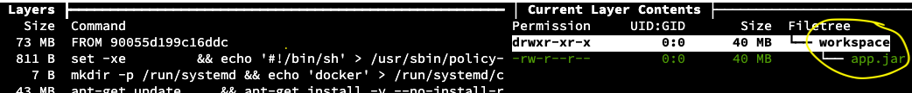
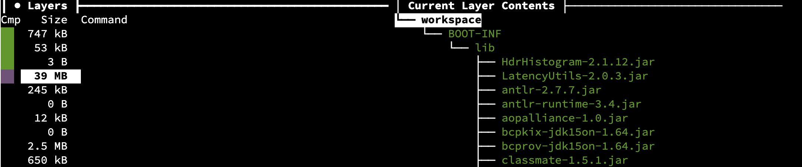
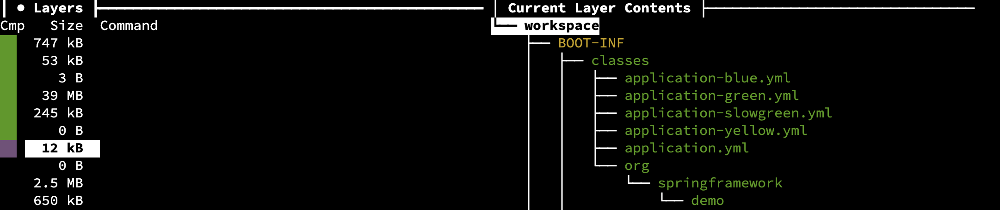

# Lift & Shift the Color Application to Kubernetes - Step 1

The color application represents a "heritage" application - an existing application that is presumably running in production and is satisfying business needs. 
However, the company is modernizing infrastructure, and operational benefit can be gained from running the application on Kubernetes.

Throughout the following exercises, you will "lift and shift" the color application to Kubernetes, with minimal changes. 

## Spring Cloud Kubernetes

Spring Cloud Kubernetes is a great way to bridge some of the differences between Spring Cloud and Kubernetes without having to make changes to your code.

Start by adding the Spring Cloud Kubernetes starter to each of the Color Application `pom.xml` files.
You can skip Config Server and Eureka Server, as you won't be needing these on Kubernetes. Instead, Spring Cloud Kubernetes will resolve service names to Kubernetes Services, an it will load application properties from Kubernetes ConfigMaps.

Start with the Auth Gateway.
Open the `pom.xml`.
```editor:open-file
file: ~/color-app/authgateway/pom.xml
```

```editor:append-lines-after-match
file: ~/color-app/authgateway/pom.xml
match: 	<dependencies>
text: |
    		<dependency>
                <groupId>org.springframework.cloud</groupId>
                <artifactId>spring-cloud-starter-kubernetes-client-all</artifactId>
            </dependency>
```

Do the same for the Routing Gateway, the Frontend, and the Color Service.
```editor:append-lines-after-match
file: ~/color-app/blueorgreengateway/pom.xml
match: 	<dependencies>
text: |
    		<dependency>
                <groupId>org.springframework.cloud</groupId>
                <artifactId>spring-cloud-starter-kubernetes-client-all</artifactId>
            </dependency>
```

```editor:append-lines-after-match
file: ~/color-app/blueorgreenfrontend/pom.xml
match: 	<dependencies>
text: |
    		<dependency>
                <groupId>org.springframework.cloud</groupId>
                <artifactId>spring-cloud-starter-kubernetes-client-all</artifactId>
            </dependency>
```

```editor:append-lines-after-match
file: ~/color-app/blueorgreenservice/pom.xml
match: 	<dependencies>
text: |
    		<dependency>
                <groupId>org.springframework.cloud</groupId>
                <artifactId>spring-cloud-starter-kubernetes-client-all</artifactId>
            </dependency>
```

To preserve local functionality with Eureka and Config Server and also support Kubernetes integration for Kubernetes deployments, you can use configuration to enable or disable Spring Cloud Kubernetes, as appropriate.
Since you will leverage Spring Cloud Kubernetes for Config, this setting must be set in a bootstrap properties|yml files.
Add configuration to enable Spring Cloud Kubernetes for a `kubernetes` profile and to disable it otherwise.
When the application runs as a pod inside Kubernetes, a Spring profile named `kubernetes` automatically gets activated.
```execute-1
# Disable by default
yq e -n '.spring.cloud.kubernetes.enabled = false' > ~/color-app/blueorgreenservice/src/main/resources/bootstrap.yml
yq e -n '.spring.cloud.kubernetes.enabled = false' > ~/color-app/blueorgreenfrontend/src/main/resources/bootstrap.yml
yq e -n '.spring.cloud.kubernetes.enabled = false' > ~/color-app/blueorgreengateway/src/main/resources/bootstrap.yml
yq e -n '.spring.cloud.kubernetes.enabled = false' > ~/color-app/authgateway/src/main/resources/bootstrap.yml

# Enable for Kubernetes profile
yq e -n '.spring.cloud.kubernetes.enabled = true' > ~/color-app/blueorgreenservice/src/main/resources/bootstrap-kubernetes.yml
yq e -n '.spring.cloud.kubernetes.enabled = true' > ~/color-app/blueorgreenfrontend/src/main/resources/bootstrap-kubernetes.yml
yq e -n '.spring.cloud.kubernetes.enabled = true' > ~/color-app/blueorgreengateway/src/main/resources/bootstrap-kubernetes.yml
yq e -n '.spring.cloud.kubernetes.enabled = true' > ~/color-app/authgateway/src/main/resources/bootstrap-kubernetes.yml
```

Since you will not be using Eureka Server on Kubernetes, you should also disable Eureka client behavior.
This can be done in the application properties|yml file.
```execute-1
yq e -n '.eureka.client.enabled = false' -i ~/color-app/config-files/application-kubernetes.yml

cat ~/color-app/config-files/application-kubernetes.yml
```

## Container images

The next step is to package the applications as container images.

The apps cannot be deployed as plain .class or .jar files on Kubernetes. 
Instead, each application, along with all of its dependencies - including all Spring and other supporting libraries, the JRE, and the OS filesystem itself - must be packaged into a bundle that adheres to a standard format (Docker or OCI, which stands for Open Container Initiative). 
The container image is, hence, a standardized, complete, self-contained, executable bundle. 
It is immutable, meaning it cannot be changed. 
Container images provide operational simplicity because they alleviate the burden of having to prepare or maintain dependencies on the target runtime environment. 
They make applications easily portable across any runtime that supports Docker or OCI images, and they enable any configuration, such as environment variables, that should be constant across environments to be packaged into the application, hence providing opportunities to better secure the application.

There are several ways to build container images, and you can often choose between creating images from source code or from a packaged jar file.
In the following steps, you will explore two approaches for creating images: Dockerfile and Cloud Native Buildpacks.
Both approaches support creating images either from source code or from packaged files (e.g. `.jar`).
If you build the images from source code, you will need to wait for all dependencies to download four times, which can take quite a bit of time.
This is because each build would create its own  `~/.m2` inside the build image (the build images would not use the host system's `~/.m2` repo or share their own with other build images).
To make things quicker, the following instructions will guide you through creating `.jar` files on the host system first, taking advantage of the existing local `~/.m2` repository for all .jar file builds.

Run the following command to build the jar files:
```execute-1
cd blueorgreenservice && nohup ./mvnw clean package -DskipTests -Dspring.cloud.contract.verifier.skip=true > jar-blueandgreenservice.out 2>&1 </dev/null &

cd blueorgreenfrontend && nohup ./mvnw clean package -DskipTests > jar-frontend.out 2>&1 </dev/null &

cd blueorgreengateway && nohup ./mvnw clean package -DskipTests > jar-gateway.out 2>&1 </dev/null &

cd authgateway && nohup ./mvnw clean package -DskipTests > jar-authgateway.out 2>&1 </dev/null &
```

Run the following command repeatedly until you get see four (4) jars listed.
```execute-1
ls -l ./*/target/*.jar
```

## Build container images with Dockerfile

Dockerfile is the oldest approach for scripting the process of building images. 
A Dockerfile is just that: a script created using Dockerfile instructions that produces a Docker image. 
Since it is a plain text file that uses a simple syntax, it serves as a transparent record of the software that has been installed into the image, and it can be saved to a version control system, along with your application code. 
Dockerfiles are powerful because they can be used for any kind of application.

Copy the following code to the Dockerfile. 
Notice that, as its base, it uses a JRE image that is publicly available on Docker Hub. 
For improved security, it sets the runtime user to a non-root user.
Finally, it declares the start command that should be executed when a container is instantiated from this image.

```editor:append-lines-to-file
file: ~/color-app/Dockerfile
text: |
        FROM adoptopenjdk:11-jre-hotspot
        WORKDIR /workspace
        COPY target/*.jar app.jar
        USER 1002
        CMD ["java", "-jar", "app.jar"]
```

Create a Docker image for the color service.
To execute the Dockerfile, use the `docker` CLI to communicate with the docker daemon.
The following command says to execute the Dockerfile you just created in the build context `blueorgreenservice` (aka using the files in `~/color-app/blueorgreenservice`), and to name (or `tag`) that image as `blueorgreenservice:df`. 
```execute-1
docker build blueorgreenservice -f Dockerfile -t blueorgreenservice:df
```

Follow along in the output as each Docker instruction is executed. 
Each instruction creates a layer in the image. 
You can think of layers as analogous to `git commits` in a git repo. 
Each committed layer adds changes as a single event that are discrete from the layers before it. 
If the Dockerfile is executed again and there have been no changes to any of the instructions or to any of the files being copied into the image, then the layers are reused, not recreated.

The same Dockerfile can be used to build the rest of the applications. 
This is convenient, but it's also worth pointing out some drawbacks of Dockerfiles.

The Dockerfile you use here is a relatively simple Dockerfile, but every line represents a decision - good or bad - made by the Dockerfile author (use a two-stage approach, choice of base images and granularity of version tag, the precise syntax of the maven installation instruction, handling dependencies first and separately from source code, copying the packed jar to the runtime image as a single layer...).
Omissions also represent Dockerfile author decisions (e.g. no .dockerignore file, no LABELs, etc).

Some of these decisions are specific to Java.
If the author wanted to build a Golang app, for example, they would need to make (and maintain) a new set of decisions.
In any case, the full burden of responsibility for ensuring this Dockerfile implements best practices for efficiency, security, supportability, etc falls on the Dockerfile author.

In addition, short of copying and pasting Dockerfiles into other app repos, there is no formalized mechanism for re-using or sharing Dockerfiles.
There is also no formalized mechanism for managing Dockerfiles at enterprise-scale, where challenges of support, security, governance and transparency become critically important.

A final drawback with Dockerfiles is that a change to any layer invalidates all remaining layers from being reused as cache. 
This means that if you change the base image or the version of maven, for example, but you don't make any changes to the code, the `docker build` process will "bust the cache" at the changed layer and will re-download all maven dependencies and re-build the .jar file. 
It is more desirable - for efficiency, security, and predictability - not to rebuild artifacts or layers that have not changed, but Dockerfile is only so efficient at doing so.

Alternative tools provide higher-level abstractions with very interesting advantages as compared to Dockerfile. 
In the next step, you will explore one such option: Cloud Native Buildpacks using Paketo Buildpacks.

## Build container images with Cloud Native Buildpacks & Paketo Buildpacks

Cloud Native Buildpacks (_CNB_, or _buildpacks_, for short) is a CNCF project that was established jointly by Pivotal and Heroku in 2018. 
They are an evolution of the Cloud Foundry and Heroku buildpacks that have existed since roughly 2011. 
In contrast to the original buildpacks that are tightly coupled with their respective platforms (Cloud Foundry and Heroku), the CNB project provides a standalone, standardized way to build OCI images that can be published to any OCI-compliant container registry and run on any OCI-compliant runtime platform, such as Kubernetes.

The CNB project provides an opinionated, structured way to build images through a set of APIs and a reference implementation of the orchestration logic. 
Within the CNB ecosystem, various implementations of the Platform and Buildpack API have been developed by different organizations. 
Any tool that implements the Platform API can be used by end users or by CI toolchains to produce images. 
Any module that implements the Buildpack API can be used to produce specific layers for OCI images. 
The platform is the end-user tool, and the buildpack is the framework-specific module. 
You can roughly associate platforms with the docker CLI and docker Daemon, which know how to execute a Dockerfile, and buildpacks with the logic inside a particular Dockerfile, which specifies the base images and the framework-specific logic. 
With CNB, however, we can overcome the challenges of Dockerfiles. 
Rather than write your own Dockerfile logic for each app or category of apps, you can use well-established community or commercial builpacks. 
These builpacks will by and large incorporate best practices for security an efficiency. 
In addition, CNB produces images with well thought-out layers that are not as sensitive to ordering as the layers in a Dockerfile build. 
By decoupling the platform from the orchestration logic and buildpacks, CNB has also made possible an ecosystem of platforms that fit different use cases. 
In these labs, we will explore two such platforms; the `pack` CLI and CNB-support in the Spring Boot Maven Plugin.

> Note: you can run the following commands even if the `docker build` is still running as they will execute in the second terminal window.

Paketo Buildpacks are an evolution of the Cloud Foundry buildpacks.
Set the default builder to use Paketo Buildpacks.
```execute-2
pack config default-builder paketobuildpacks/builder:base
```

To build images for each app, you use the `pack build` command. You can use this command to build images from source, as you are doing with the `Dockerfile`, but that require waiting for the maven repo in the build image to download all the Java dependencies for each image.

Use the `pack` CLI to build an image for the `blueorgreenservice`. 
```execute-2
pack build blueorgreenservice:pk --path ./blueorgreenservice/target/blueorgreen-0.0.1-SNAPSHOT.jar
```

List the images you have created so far:
```execute-1
docker images | grep blueorgreenservice
```

If both `docker build` and `pack build` have finished running, your output will look like this.
```
blueorgreenservice         df               ed51ed0f4612   8 minutes ago   289MB
blueorgreenservice         pk               adafa746205d   41 years ago    288MB
```

You can use the `docker history` command to get some more information about the first image.
Notice that you can see each layer of the runtime image (from the second build stage).
```execute-1
docker history blueorgreenservice:df
```

You can use the `pack image inspect` command to get some more information about the pack-built image.
```execute-2
pack inspect blueorgreenservice:pk
```

You can ad a `--bom` flag to the `pack image inspect` command to get more detailed information about the contents ("bill of materials") of the pack-built image.
```execute-2
pack inspect blueorgreenservice:pk --bom
```

With Cloud Native Buildpacks, you can see precise information about the base image and buildpacks used for the build (akin to the first build stage in our Dockerfile), as well as the base image and start command in the runtime image (akin to the second build stage in our Dockerfile).

You can also inspect and compare the images using a tool called `dive`. 

```execute-1
dive blueorgreenservice:df
```

- After running the command above use your keyboard to type: 
  - `Tab`, `Ctrl-U`, `Tab`
- Next, use the down arrow to move down the list of layers on the left-side window until you find the layer that adds the `app.jar` file to the runtime image that you find on the right hand side.

> Picture for reference:


The `Tab` button is used to switch between the Layer and Filetree views.
`Ctrl-U` is used in the Filetree view to show/hide unmodified files.

This configures the right-hand column (layer conents) to show only changes since the last layer). 

Do the same with the Paketo-built image. 
```execute-2
dive blueorgreenservice:pk
```
- After running the command above use your keyboard to type: 
  - `Tab`, `Ctrl-U`, `Tab`
- Next, use the down arrow to move down the list of layers on the left-side window until you find the layers that have the dependencies (.jar files) and the app code (.class, .yml, etc files) on the right hand side.

> Picture for reference of dependencies:



> Picture for reference of application-specific files:


In this case you will see the Java application was exploded, which makes for faster startup time. 
The exploded files are also organized into multiple layers, separating files that change infrequently (e.g. Spring Boot base libraries) from files that change more frequently (e.g. your code). 
The layer that is most likely to change (application-specific .class files) is now kilobytes rather than megabytes.
This makes it faster to rebuild images and publish images updates to container registries. 
In general, the layers in this image are more thoughtfully and consistently organized. 
The Paketo Java Buildpack also contributes a Memory Calculator to the launch layer, which optimizes memory settings when the application is run.


Exit `dive` in both terminals.
```execute-all
<ctrl+c>
```

Use pack to build images for the remaining Color Application services. 
```execute-1
pack build authgateway:pk --path ./authgateway/target/authgateway-0.0.1-SNAPSHOT.jar
pack build blueorgreenfrontend:pk --path ./blueorgreenfrontend/target/blueorgreenfrontend-0.0.1-SNAPSHOT.jar
pack build blueorgreengateway:pk --path ./blueorgreengateway/target/blueorgreengateway-0.0.1-SNAPSHOT.jar
```

When the above commands have completed, make sure you have four (4) pack-built images in your local Docker daemon.
```execute-1
docker images | grep pk
```

Your output should look like this.
```
[~/color-app]$  docker images | grep pk
blueorgreenfrontend        pk               edb691597d36   41 years ago    317MB
authgateway                pk               81d9a9bf36c3   41 years ago    320MB
blueorgreengateway         pk               d3b4256e51c1   41 years ago    320MB
blueorgreenservice         pk               87c13f6f548a   41 years ago    317MB
```

You can learn more about the Paketo Java Buildpack [here](https://github.com/paketo-buildpacks/java)

## Publish images to registry

In order to deploy these images to Kubernetes, Kubernetes must be able to "pull" them. 
Kubernetes cannot access them from the local Docker daemon. 
It can, however, pull them from a container registry that is network-accessible.

A local private container registry is available in this workshop environment.
For convenience, its address is saved in an environment variable. 
You can see it by running the following command.
```execute-1
echo $REGISTRY_HOST
```

Publish the images to the container registry.
```execute-1
docker tag blueorgreenservice:pk $REGISTRY_HOST/color-app/blueorgreenservice
docker push $REGISTRY_HOST/color-app/blueorgreenservice

docker tag blueorgreenfrontend:pk $REGISTRY_HOST/color-app/blueorgreenfrontend
docker push $REGISTRY_HOST/color-app/blueorgreenfrontend

docker tag blueorgreengateway:pk $REGISTRY_HOST/color-app/blueorgreengateway
docker push $REGISTRY_HOST/color-app/blueorgreengateway

docker tag authgateway:pk $REGISTRY_HOST/color-app/authgateway
docker push $REGISTRY_HOST/color-app/authgateway
```

## Validate that the containers are in the registry
```execute-1
skopeo list-tags docker://$REGISTRY_HOST/color-app/blueorgreenservice
```

```execute-1
skopeo list-tags docker://$REGISTRY_HOST/color-app/blueorgreenfrontend
```

```execute-1
skopeo list-tags docker://$REGISTRY_HOST/color-app/blueorgreengateway
```

```execute-1
skopeo list-tags docker://$REGISTRY_HOST/color-app/authgateway
```
