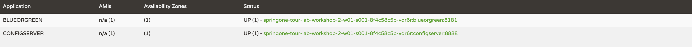

## Start The 'blue' Instance
Next, build and start a Backend app instance using the blue profile.
> Note: In this workshop environment, we are choosing to use `java -jar` rather than `mvn spring-boot:run` to start the apps locally. This way, the Backend service is built once and the same jar is used to start all color instances, and we can minimize runtime memory consumption by avoiding additional maven processes.
```execute-1
cd blueorgreenservice && \
   ./mvnw package -DskipTests \
        > ../logs/build-blueorgreen.log 2>&1 </dev/null && \
   java -Xmx32M -Dspring.profiles.active=blue \
        -jar target/blueorgreen-0.0.1-SNAPSHOT.jar \
        > ../logs/run-blue.log 2>&1 </dev/null &
```

Run the following command repeatedly until you see a line of output confirming that the blue instance has started.
```execute-1
cat logs/run-blue.log | grep "started on port"
```

The output should look like this.
```
2021-04-20 21:58:43.563  INFO 798 --- [           main] o.s.b.w.embedded.tomcat.TomcatWebServer  : Tomcat started on port(s): 8181 (http) with context path ''
```

As you can see in the log output, blue started on port 8181.

Send a request to the blue app.

```execute-1
http -b :8181
```

The response will look like this.
```
{
    "id": "blue"
}
```

Refresh the Eureka dashboard in your browser until you see that the blue app has registered itself.
It uses the application name `BLUEORGREEN`.

> Picture for reference of the blue app registered in Eureka Server:


## Start The Remaining Backend Instances
Start three more Backend instances: green, slowgreen, and yellow.
The profiles are configured such that each will run on a different port to prevent conflicts on the same host.
```execute-1
cd blueorgreenservice && \
   java -Xmx32M -Dspring.profiles.active=green \
        -jar target/blueorgreen-0.0.1-SNAPSHOT.jar \
        > ../logs/run-green.log 2>&1 </dev/null &

cd blueorgreenservice && \
   java -Xmx32M -Dspring.profiles.active=slowgreen \
        -jar target/blueorgreen-0.0.1-SNAPSHOT.jar \
        > ../logs/run-slowgreen.log 2>&1 </dev/null &

cd blueorgreenservice && \
   java -Xmx32M -Dspring.profiles.active=yellow \
        -jar target/blueorgreen-0.0.1-SNAPSHOT.jar \
        > ../logs/run-yellow.log 2>&1 </dev/null &
```

Refresh the Eureka dashboard again until you see all four Backend instances registered.
You should see an Application named `BLUEORGREEN` with four endpoints under the `Status` column, each with a unique port number.

> Picture for reference of Backend apps registered in Eureka Server:


Send a request to slowgreen. Notice that it takes 5 seconds to return.
```execute-1
time http :6060
```
