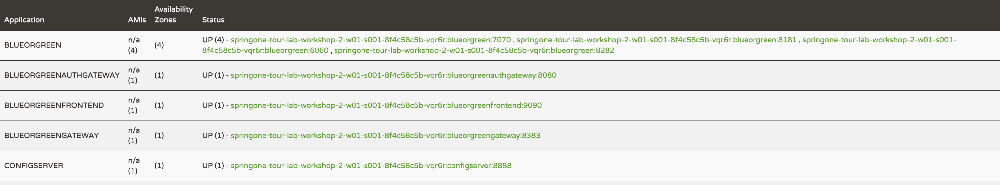

Start the Frontend, the Routing Gateway, and the Auth Gateway.
```execute-1
cd blueorgreenfrontend && \
   ./mvnw package -DskipTests \
        > ../logs/build-frontend.log 2>&1 </dev/null && \
   java -Xms32M -Xmx32M -Dspring.profiles.active=local \
        -jar target/blueorgreenfrontend-0.0.1-SNAPSHOT.jar \
        > ../logs/run-frontend.log 2>&1 </dev/null &
    
cd blueorgreengateway && \
   ./mvnw package -DskipTests \
        > ../logs/build-gateway.log 2>&1 </dev/null && \
   java -Xms32M -Xmx32M \
        -jar target/blueorgreengateway-0.0.1-SNAPSHOT.jar \
        > ../logs/run-gateway.log 2>&1 </dev/null &

cd authgateway && \
   ./mvnw package -DskipTests \
        > ../logs/build-authgateway.log 2>&1 </dev/null && \
   java -Xms32M -Xmx32M \
        -jar target/authgateway-0.0.1-SNAPSHOT.jar \
        > ../logs/run-authgateway.log 2>&1 </dev/null &
```

Make sure you see build and run logs being created for these three apps.
You should see a total of 11 files (4 build logs and 8 run logs).
You can use the `cat` command as before to see the contents of any file.
```execute-1
ls -l logs/
```

The output should look like this:
```
-rw-r--r-- 1 eduk8s root  59027 May 11 18:08 build-authgateway.log
-rw-r--r-- 1 eduk8s root 118665 May 11 18:06 build-blueorgreen.log
-rw-r--r-- 1 eduk8s root   2236 May 11 18:07 build-frontend.log
-rw-r--r-- 1 eduk8s root 130307 May 11 18:08 build-gateway.log
-rw-r--r-- 1 eduk8s root   8823 May 11 18:08 run-authgateway.log
-rw-r--r-- 1 eduk8s root   6539 May 11 18:06 run-blue.log
-rw-r--r-- 1 eduk8s root   6347 May 11 18:08 run-frontend.log
-rw-r--r-- 1 eduk8s root   8402 May 11 18:08 run-gateway.log
-rw-r--r-- 1 eduk8s root   6113 May 11 18:06 run-green.log
-rw-r--r-- 1 eduk8s root   6550 May 11 18:07 run-slowgreen.log
-rw-r--r-- 1 eduk8s root 165452 May 11 18:10 run-spring-cloud.log
-rw-r--r-- 1 eduk8s root   6115 May 11 18:06 run-yellow.log
```

Refresh the Eureka dashboard again until you see all apps registered.
You should see four distinct application names in the Application column.

> Picture for reference of all apps registered in Eureka Server:

